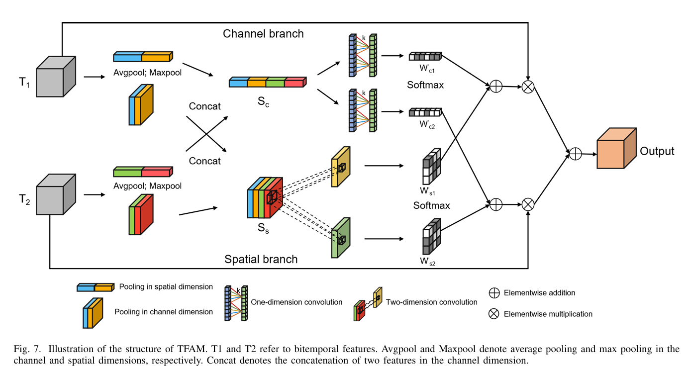

# 题目: Exchanging Dual Encoder-Decoder: A New Strategy for Change Detection with Semantic Guidance and Spatial Localization  
## Type
双时相特征融合
***
# Overview  
***
TFAM(temporal fusion
 attention modules)包括两个分支，通道分支（channel branch）和空间分支（spatial branch）。通道分支用于增强通道信息关注，空间分支用于增强空间信息关注。对两个输入特征同时进行空间维度池化和通道维度池化，接着分别将空间维度池化和通道维度池化进行Concat，随后进行权重确定，保留有用信息，最后进行分离。通过权重调整，保留了双时相特征中更有价值的部分，同时抑制了不重要或误导性的信息，从而提高了变化检测的准确性和鲁棒性。
  

# Usage  
***
```python
import torch
if __name__=="__main__":
    img_time1 = torch.rand(2, 64, 64, 64)
    img_time2 = torch.rand(2, 64, 64, 64)
    Tfam = TFAM(64)
    fused_img=Tfam(img_time1,img_time2)
    print(f"fused shape is {fused_img.shape}")
```

# Reference  
***
[https://blog.csdn.net/qq_51511878/article/details/138000632](https://blog.csdn.net/qq_51511878/article/details/138000632)  
Zhao S, Zhang X, Xiao P, et al. [Exchanging dual-encoder–decoder: A new strategy for change detection with semantic guidance and spatial localization](./paper/A%20New%20Strategy%20for%20Change%20Detection%20with%20Semantic%20Guidance%20and%20Spatial%20Localization.pdf)[J]. IEEE Transactions on Geoscience and Remote Sensing, 2023, 61: 1-16.