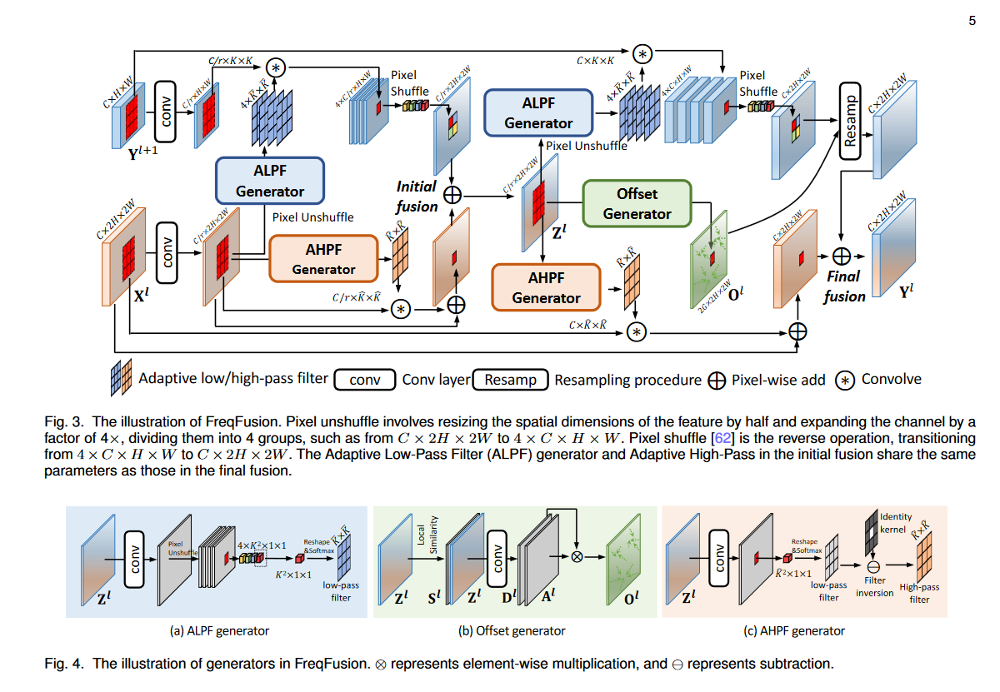

# 题目: Frequency-aware Feature Fusion for Dense Image Prediction  
## Type  
多尺度特征融合
***
# Overview  
***
本文中，作者观察到融合后的特征值在物体内部存在快速变化，导致因高频特征扰动而产生的类内不一致性。此外，融合特征中的模糊边界缺乏准确的高频信息，从而导致边界偏移。基于这些观察，提出了频率感知特征融合（FreqFusion），其集成了自适应低通滤波器（ALPF）生成器、偏移生成器和自适应高通滤波器（AHPF）生成器。ALPF生成器预测空间变化的低通滤波器，以衰减物体内部的高频成分，从而减少上采样过程中的类内不一致性。偏移生成器通过重采样将不一致特征替换为更一致的特征，从而优化大范围不一致特征和细边界，而AHPF生成器则增强了下采样过程中丢失的高频细节边界信息。
  

# Usage  
***
```python
import torch
hr_feat = torch.rand(1, 128, 512, 512)
lr_feat = torch.rand(1, 128, 256, 256)
model = FreqFusion(hr_channels=128, lr_channels=128)
mask_lr, hr_feat, lr_feat = model(hr_feat=hr_feat, lr_feat=lr_feat)
print(mask_lr.shape)
```

# Reference  
***
Chen L, Fu Y, Gu L, et al. [Frequency-aware feature fusion for dense image prediction](./paper/Chen%20等%20-%202024%20-%20Frequency-aware%20Feature%20Fusion%20for%20Dense%20Image%20Pre.pdf)[J]. IEEE Transactions on Pattern Analysis and Machine Intelligence, 2024, 46(12): 10763-10780