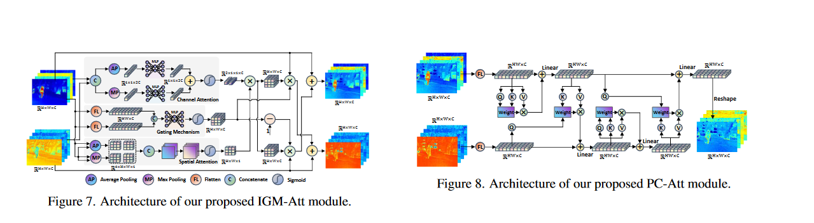

# 题目: Mutually Reinforcing Image Fusion and Segmentation  
## Type
红外-可见光融合
***
# Overview  
***
本文提出了一种名为MRFS的耦合学习框架，旨在突破红外-可见光图像融合与分割的性能瓶颈。该框架通过利用视觉与语义之间的内在一致性，强调两者之间的相互增强，而非将其视为独立问题。首先，将弱化信息恢复与显著信息整合嵌入到图像融合任务中，采用基于CNN的交互门控混合注意力（IGM-Att）模块来提取高质量的视觉特征。这一设计旨在满足人类视觉感知需求，生成具有丰富纹理、高对比度和鲜艳色彩的融合图像。其次，开发了一种基于Transformer的渐进循环注意力（PC-Att）模块，以增强语义分割能力。该模块通过建立单模态自我增强与跨模态互补机制，使机器语义感知能够做出更准确的决策。随后，IGM-Att与PC-Att的级联将图像融合与语义分割任务耦合在一起，隐式地将视觉相关特征与语义相关特征更紧密地对齐。因此，两者相互提供学习先验，从而生成视觉上令人满意的融合图像以及更精确的分割决策
  

# Usage  
***
```python
import torch
if __name__ == '__main__':
    x=torch.rand(2,128,64,64)
    y=torch.rand(2,128,64,64)
    
    igm_attn=IGMAVC(dim=128)
    x_out,y_out=igm_attn(x,y)
    print(x_out.shape,y_out.shape)
    pcattn=PCASC(dim=128,out_dim=64)
    out=pcattn(x_out,y_out)
```

# Reference  
***
Zhang H, Zuo X, Jiang J, et al. [MRFS: Mutually Reinforcing Image Fusion and Segmentation](./paper/Zhang%20等%20-%202024%20-%20MRFS%20Mutually%20Reinforcing%20Image%20Fusion%20and%20Segmen.pdf)[C]//Proceedings of the IEEE/CVF Conference on Computer Vision and Pattern Recognition. 2024: 26974-26983.